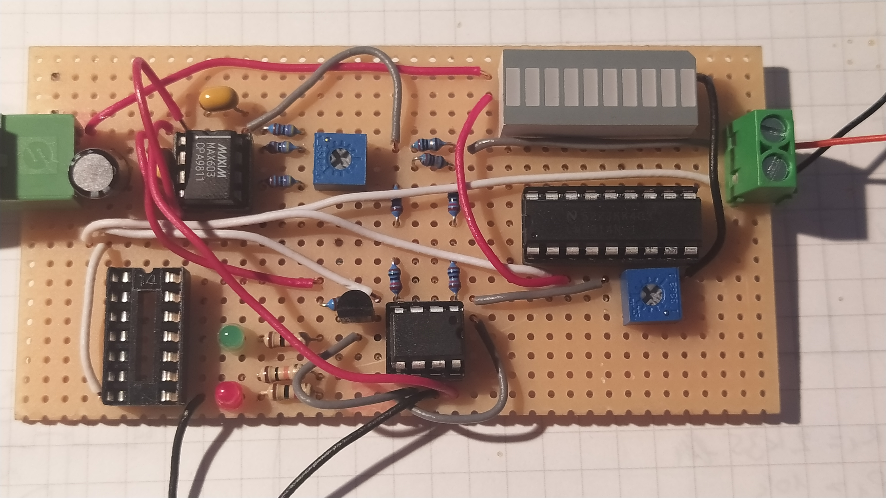

# laser-driver-max603

A laser driver based on the MAX603 chip with a fancy bar graph display. 
As a challenge, I kept the involvement of the machine spirit inside this product to a minimum. (So no ATTiny85 this time.) Later I might add some 74LS NAND or NOR logic wizardry (SR flip-flop).

The bar graph was a nice touch, but the LM3914 nearly doubled the BOM cost.

The circuit was designed for a [12*15mm 635nm 30mW Orange/Red Dot Laser Module](https://www.laserlands.net/diode-laser-module/600nm-640nm-orange-red-laser-module/635dot/1pc-635nm-30mw-orange-red-laser-diode-module-i-12x15mm-no-driver.html) from Laserland, but it can be modified for other laser diodes and other current ranges.
